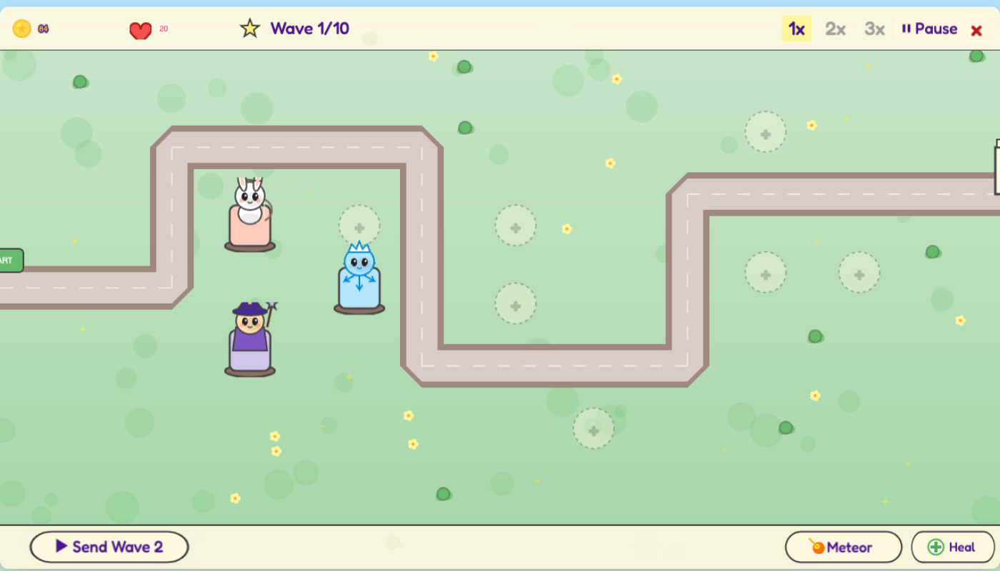
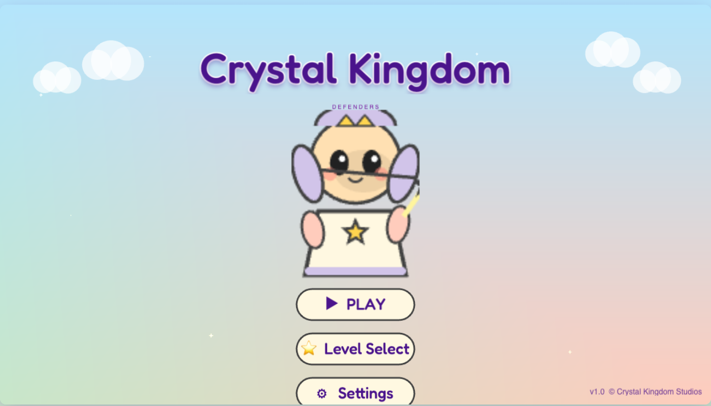

# Crystal Kingdom Defenders

> 🇬🇧 **English** | [🇻🇳 Tiếng Việt](#-tiếng-việt)

> A **chibi-style 2D tower defense game** that runs entirely in the browser — no installation, no backend required.


[](https://github.com/ds-mrtq/crystal-kingdom-defenders/actions/workflows/deploy-pages.yml)
[](https://github.com/ds-mrtq/crystal-kingdom-defenders/actions/workflows/docker-ghcr.yml)

## Play Now

> **[https://ds-mrtq.github.io/crystal-kingdom-defenders/](https://ds-mrtq.github.io/crystal-kingdom-defenders/)**

Or pull the Docker image:

```bash
docker run --rm -p 8080:8080 ghcr.io/ds-mrtq/crystal-kingdom-defenders:latest
# Open http://localhost:8080/
```

---

## About

**Princess Lumi**, heir of House Crystalwood, must summon four chibi companions to defend the **Five Crystal Temples** from the Shadow King's dark army across five lands:

Whispering Forest &rarr; Crimson Hills &rarr; Frostpeak Pass &rarr; Skyspire Ruins &rarr; Throne of Night

### Key Features

- **Bilingual UI** &mdash; switch between English and Vietnamese in Settings
- **100% procedural chibi graphics** &mdash; every sprite is generated at runtime via Canvas API, zero external assets
- **Procedural chiptune audio** &mdash; music & SFX synthesized with the Web Audio API
- **5 levels &times; 10 waves = 50 waves** of progressively harder enemies
- **4 tower types &times; 3 upgrade tiers** (Archer, Mage, Cannon, Frost)
- **5 enemy types** (Slime, Wolf, flying Bat, Bear tank, Boss)
- **2 hero abilities** (Meteor Strike + Healing Light)
- **Speed control** (1&times;/2&times;/3&times;) + pause
- **Auto-save** to `localStorage` with a 3-star rating system
- **Story cutscenes** before and after each level

## Screenshots

<table>
<tr>
<td></td>
<td></td>
</tr>
<tr>
<td align="center">Main Menu</td>
<td align="center">Level 1 &mdash; Whispering Forest</td>
</tr>
<tr>
<td></td>
<td></td>
</tr>
<tr>
<td align="center">Tower Placement & Combat</td>
<td align="center">Story Cutscene</td>
</tr>
<tr>
<td></td>
<td></td>
</tr>
<tr>
<td align="center">Level 5 &mdash; Throne of Night</td>
<td align="center">Victory Screen</td>
</tr>
</table>

## Getting Started

### Prerequisites

- Node.js 18+

### Installation

```bash
git clone https://github.com/ds-mrtq/crystal-kingdom-defenders.git
cd crystal-kingdom-defenders
npm install
```

### Development

```bash
npm run dev
# Open http://localhost:5173/
```

### Production Build

```bash
npm run build      # Outputs to dist/
npm run preview    # Preview the production build locally
```

### Lint, Format & Type Check

```bash
npm run lint       # ESLint
npm run format     # Prettier
npx tsc --noEmit   # TypeScript type check
npm run test       # Vitest
```

## Tech Stack

| Layer       | Choice                       |
|-------------|------------------------------|
| Language    | TypeScript 5.x (strict mode) |
| Game Engine | Phaser 3.80+                 |
| Build Tool  | Vite 5.x                     |
| Graphics    | Canvas API + Phaser Graphics |
| Audio       | Web Audio API (procedural)   |
| Storage     | `localStorage`               |
| Linting     | ESLint + Prettier            |
| Testing     | Vitest                       |

**No Docker, no backend, no API required to run the game.**

## Project Structure

```
crystal-kingdom-defenders/
├── src/
│   ├── main.ts                    # Phaser bootstrap & game config
│   ├── audio/
│   │   └── AudioSystem.ts         # Procedural chiptune music & SFX
│   ├── config/
│   │   ├── BalanceConfig.ts       # Tower/enemy stats & tuning
│   │   ├── GameConfig.ts          # Phaser engine configuration
│   │   └── LevelConfig.ts        # 5 level definitions (paths, waves)
│   ├── entities/
│   │   ├── Enemy.ts               # Enemy class (HP, movement, types)
│   │   ├── Projectile.ts          # Projectile motion & impact
│   │   └── Tower.ts               # Tower targeting, firing & upgrades
│   ├── graphics/
│   │   ├── ChibiPainter.ts        # Canvas drawing primitives (chibi style)
│   │   └── SpriteFactory.ts       # Runtime sprite generation for all assets
│   ├── i18n/
│   │   ├── I18n.ts                # Language manager singleton
│   │   ├── en.ts                  # English translations
│   │   └── vi.ts                  # Vietnamese translations
│   ├── save/
│   │   └── SaveSystem.ts          # localStorage save/load
│   ├── scenes/
│   │   ├── BootScene.ts           # Asset generation & loading
│   │   ├── MenuScene.ts           # Title screen & navigation
│   │   ├── LevelSelectScene.ts    # Level map with lock/star states
│   │   ├── StoryScene.ts          # Dialogue cutscenes
│   │   ├── GameScene.ts           # Core tower defense gameplay
│   │   ├── UIScene.ts             # HUD overlay (gold, lives, wave, abilities)
│   │   └── ResultScene.ts         # Victory/defeat screen
│   ├── systems/
│   │   ├── AbilityManager.ts      # Meteor Strike & Healing Light
│   │   └── WaveManager.ts         # Wave spawning & progression
│   └── types/
│       └── index.ts               # Shared TypeScript types
├── index.html                     # Game entry point
├── vite.config.ts                 # Vite build configuration
├── tsconfig.json                  # TypeScript strict config
├── Dockerfile                     # Multi-stage build (Node + Nginx)
├── docker-compose.yml             # Local dev with Docker
├── docker-compose.prod.yml        # Production deployment (GHCR image)
├── nginx.conf                     # Nginx config for static serving
├── PRD.md                         # Product Requirements Document
├── IMPLEMENTATION_PLAN.md         # Implementation plan with progress tracking
└── TEST_PLAN.md                   # Test plan (123 test cases)
```

## Docker Deployment

### Build & Run Locally

```bash
docker build -t crystal-kingdom-defenders .
docker-compose up -d
# Open http://localhost:8090/
```

### Production (from GHCR)

```bash
# Pull the pre-built multi-arch image (amd64 + arm64)
docker pull ghcr.io/ds-mrtq/crystal-kingdom-defenders:latest

# Run with hardened settings
docker-compose -f docker-compose.prod.yml up -d
# Open http://localhost/
```

## CI/CD

| Workflow | Trigger | Description |
|----------|---------|-------------|
| [Deploy to GitHub Pages](.github/workflows/deploy-pages.yml) | Push to `main` | Type-checks, builds, and deploys `dist/` to GitHub Pages |
| [Build & Push Docker GHCR](.github/workflows/docker-ghcr.yml) | Push to `main` or version tags | Builds multi-arch Docker image with SLSA provenance attestation |

## Documentation

- [`PRD.md`](./PRD.md) &mdash; Full product requirements document
- [`IMPLEMENTATION_PLAN.md`](./IMPLEMENTATION_PLAN.md) &mdash; Implementation plan with task checkboxes
- [`TEST_PLAN.md`](./TEST_PLAN.md) &mdash; Test plan with 123 test cases

## Contributing

1. Fork the repository
2. Create a feature branch (`git checkout -b feature/amazing-feature`)
3. Make your changes
4. Run checks: `npm run lint && npx tsc --noEmit`
5. Commit your changes (`git commit -m 'Add amazing feature'`)
6. Push to the branch (`git push origin feature/amazing-feature`)
7. Open a Pull Request

## License

MIT &mdash; free to use, modify, and learn from.

---

# 🇻🇳 Tiếng Việt

> [🇬🇧 English](#crystal-kingdom-defenders) | **🇻🇳 Tiếng Việt**

> Game **phòng thủ tháp 2D phong cách chibi** chạy hoàn toàn trên trình duyệt — không cần cài đặt, không cần backend.

## Chơi Ngay

> **[https://ds-mrtq.github.io/crystal-kingdom-defenders/](https://ds-mrtq.github.io/crystal-kingdom-defenders/)**

Hoặc chạy bằng Docker:

```bash
docker run --rm -p 8080:8080 ghcr.io/ds-mrtq/crystal-kingdom-defenders:latest
# Mở http://localhost:8080/
```

---

## Giới Thiệu

**Công chúa Lumi**, người thừa kế của Gia tộc Crystalwood, phải triệu hồi bốn chiến hữu chibi để bảo vệ **Năm Đền Pha Lê** khỏi đội quân bóng tối của Vua Bóng Tối qua năm vùng đất:

Khu Rừng Thì Thầm &rarr; Đồi Đỏ Thắm &rarr; Đèo Đỉnh Băng &rarr; Phế Tích Tháp Trời &rarr; Ngai Vàng Bóng Đêm

### Tính Năng Chính

- **Giao diện song ngữ** &mdash; chuyển đổi giữa Tiếng Anh và Tiếng Việt trong Cài Đặt
- **Đồ họa chibi 100% tự sinh** &mdash; toàn bộ sprite được tạo lúc chạy bằng Canvas API, không dùng asset ngoài
- **Nhạc chiptune tự sinh** &mdash; nhạc & hiệu ứng âm thanh tổng hợp bằng Web Audio API
- **5 màn chơi &times; 10 đợt = 50 đợt** quái vật ngày càng khó
- **4 loại tháp &times; 3 cấp nâng cấp** (Cung Thủ, Pháp Sư, Đại Bác, Băng Giá)
- **5 loại quái** (Slime, Sói, Dơi bay, Gấu, Boss)
- **2 kỹ năng anh hùng** (Sao Băng + Ánh Sáng Chữa Lành)
- **Điều khiển tốc độ** (1&times;/2&times;/3&times;) + tạm dừng
- **Tự động lưu** vào `localStorage` với hệ thống xếp hạng 3 sao
- **Cảnh phim** trước và sau mỗi màn chơi

## Ảnh Chụp Màn Hình

<table>
<tr>
<td></td>
<td></td>
</tr>
<tr>
<td align="center">Trang Chủ</td>
<td align="center">Màn 1 &mdash; Khu Rừng Thì Thầm</td>
</tr>
<tr>
<td></td>
<td></td>
</tr>
<tr>
<td align="center">Đặt Tháp & Chiến Đấu</td>
<td align="center">Cảnh Phim</td>
</tr>
<tr>
<td></td>
<td></td>
</tr>
<tr>
<td align="center">Màn 5 &mdash; Ngai Vàng Bóng Đêm</td>
<td align="center">Chiến Thắng</td>
</tr>
</table>

## Bắt Đầu

### Yêu Cầu

- Node.js 18+

### Cài Đặt

```bash
git clone https://github.com/ds-mrtq/crystal-kingdom-defenders.git
cd crystal-kingdom-defenders
npm install
```

### Phát Triển

```bash
npm run dev
# Mở http://localhost:5173/
```

### Build Production

```bash
npm run build      # Xuất ra dist/
npm run preview    # Xem trước bản build production
```

### Kiểm Tra Code

```bash
npm run lint       # ESLint
npm run format     # Prettier
npx tsc --noEmit   # Kiểm tra kiểu TypeScript
npm run test       # Vitest
```

## Công Nghệ

| Tầng        | Lựa Chọn                     |
|-------------|-------------------------------|
| Ngôn ngữ    | TypeScript 5.x (strict mode) |
| Game Engine | Phaser 3.80+                  |
| Build Tool  | Vite 5.x                      |
| Đồ họa      | Canvas API + Phaser Graphics  |
| Âm thanh    | Web Audio API (tự sinh)       |
| Lưu trữ     | `localStorage`                |
| Linting     | ESLint + Prettier             |
| Testing     | Vitest                        |

**Không cần Docker, không cần backend, không cần API để chạy game.**

## Tài Liệu

- [`PRD.md`](./PRD.md) &mdash; Tài liệu yêu cầu sản phẩm
- [`IMPLEMENTATION_PLAN.md`](./IMPLEMENTATION_PLAN.md) &mdash; Kế hoạch triển khai với danh sách task
- [`TEST_PLAN.md`](./TEST_PLAN.md) &mdash; Kế hoạch kiểm thử với 123 test case

## Đóng Góp

1. Fork repository
2. Tạo nhánh tính năng (`git checkout -b feature/tinh-nang-moi`)
3. Thực hiện thay đổi
4. Chạy kiểm tra: `npm run lint && npx tsc --noEmit`
5. Commit (`git commit -m 'Thêm tính năng mới'`)
6. Push nhánh (`git push origin feature/tinh-nang-moi`)
7. Mở Pull Request

## Giấy Phép

MIT &mdash; tự do sử dụng, chỉnh sửa, và học hỏi.

---

*Built with [Agentic Vibe Coding](https://github.com/ds-mrtq/crystal-kingdom-defenders) &mdash; 16 implementation phases, ~5,200 lines of TypeScript, 104/123 tests passing.*
