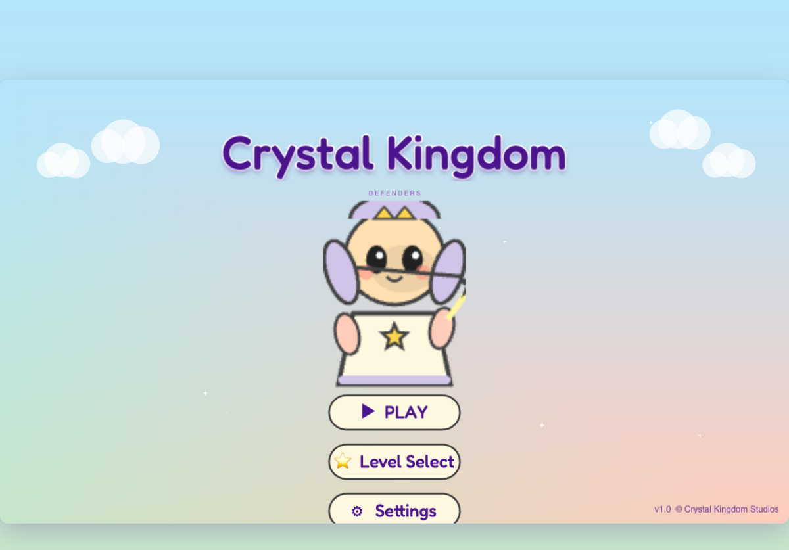
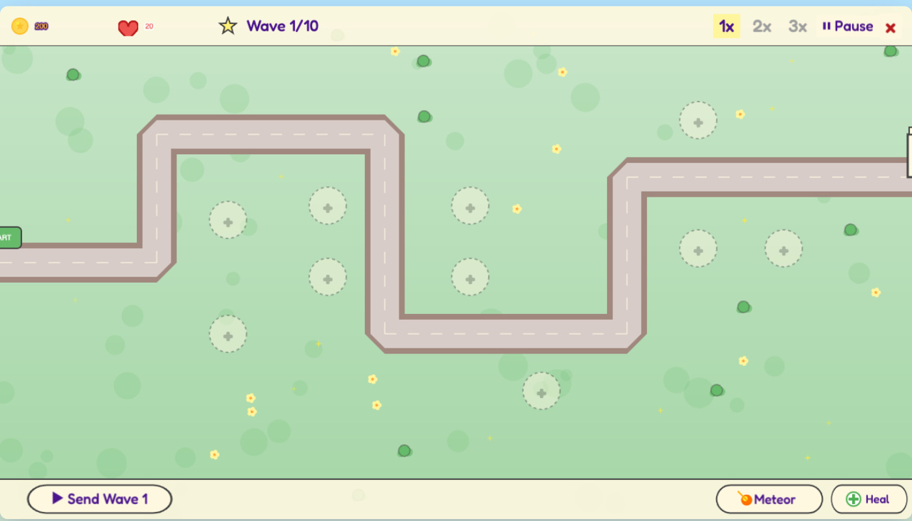
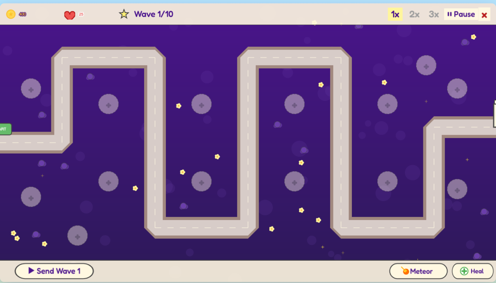
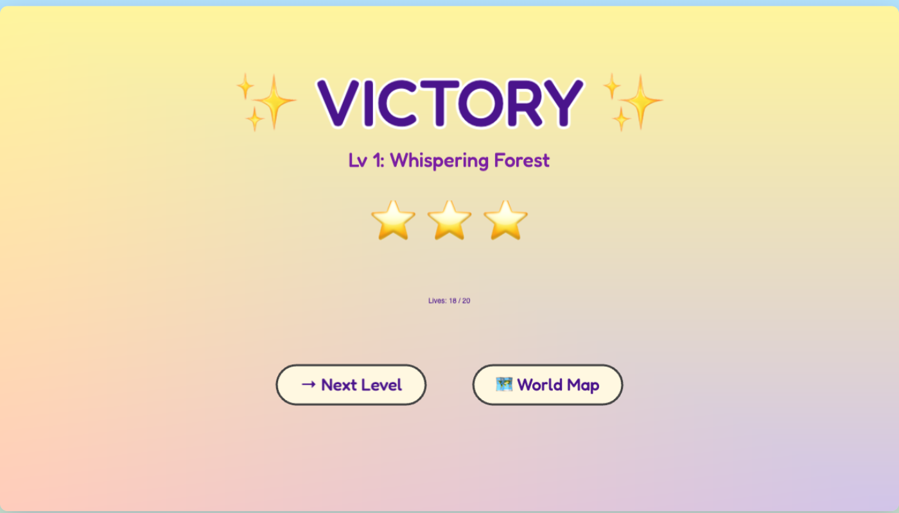

# 🌟 Crystal Kingdom Defenders (Vương Quốc Pha Lê)

> Game **tower defense 2D phong cách chibi**, chạy hoàn toàn trên trình duyệt — không cần cài đặt, không cần backend.


[](https://github.com/ds-mrtq/crystal-kingdom-defenders/actions/workflows/deploy-pages.yml)
[](https://github.com/ds-mrtq/crystal-kingdom-defenders/actions/workflows/docker-ghcr.yml)

## 🎮 Chơi Ngay

> **🌐 [https://ds-mrtq.github.io/crystal-kingdom-defenders/](https://ds-mrtq.github.io/crystal-kingdom-defenders/)**

Hoặc kéo Docker image:
```bash
docker run --rm -p 8080:8080 ghcr.io/ds-mrtq/crystal-kingdom-defenders:latest
# Mở http://localhost:8080/
```

---

## 🎮 Giới Thiệu

**Công Chúa Lumi**, người thừa kế của nhà Crystalwood, phải triệu tập 4 chiến hữu chibi đáng yêu để bảo vệ **5 Đền Pha Lê** khỏi đạo quân Bóng Tối của Shadow King qua 5 vùng đất:

🌳 Rừng Thì Thầm → 🏔 Đồi Đỏ Thẫm → ❄️ Đèo Băng Frostpeak → ☁️ Tàn Tích Skyspire → 👑 Ngai Vàng Đêm Tối

### Đặc Điểm Nổi Bật
- 🎨 **Đồ họa chibi 100% procedural** — mọi sprite được sinh tự động bằng Canvas API, không cần asset
- 🎵 **Nhạc chiptune procedural** — Web Audio API tự sinh nhạc & SFX
- ⚡ **5 màn × 10 wave = 50 wave** với độ khó tăng dần
- 🏰 **4 loại tháp × 3 tier nâng cấp** (Archer, Mage, Cannon, Frost)
- 👹 **5 loại quái** (Slime, Wolf, Bat bay, Bear tank, Boss)
- ✨ **2 hero abilities** (Meteor Strike + Healing Light)
- ⏩ **Speed control 1x/2x/3x** + pause
- 💾 **Save tự động** vào localStorage với hệ thống 3 sao
- 📜 **Story cutscenes** trước/sau mỗi level

## 🚀 Chạy Game

### Yêu cầu
- Node.js 18+

### Setup
```bash
git clone https://github.com/<your-username>/crystal-kingdom-defenders.git
cd crystal-kingdom-defenders
npm install
```

### Dev mode
```bash
npm run dev
# Mở http://localhost:5173/
```

### Build production
```bash
npm run build      # Output ra dist/
npm run preview    # Preview build
```

### Type check
```bash
npx tsc --noEmit
```

## 🛠 Tech Stack

| Layer        | Lựa chọn                     |
|--------------|------------------------------|
| Ngôn ngữ     | TypeScript 5.x (strict)      |
| Game Engine  | Phaser 3.80+                 |
| Build Tool   | Vite 5.x                     |
| Đồ họa       | Canvas API + Phaser Graphics |
| Audio        | Web Audio API (procedural)   |
| Storage      | `localStorage`               |

**Không cần Docker, không cần backend, không cần API.**

## 📂 Cấu Trúc Dự Án

```
src/
├── main.ts                  # Phaser bootstrap
├── audio/AudioSystem.ts     # Procedural music & SFX
├── config/                  # Game/Balance/Level configs
├── entities/                # Tower, Enemy, Projectile
├── graphics/                # ChibiPainter + SpriteFactory
├── save/SaveSystem.ts       # localStorage
├── scenes/                  # Boot, Menu, LevelSelect, Story, Game, UI, Result
├── systems/                 # Wave, Ability managers
└── types/                   # Shared TS types
```

## 📖 Tài Liệu

- [`PRD.md`](./PRD.md) — Tài liệu yêu cầu sản phẩm đầy đủ
- [`IMPLEMENTATION_PLAN.md`](./IMPLEMENTATION_PLAN.md) — Kế hoạch implement với checkbox
- [`TEST_PLAN.md`](./TEST_PLAN.md) — Test plan với 123 test case
- [`screenshots/`](./screenshots) — Ảnh chụp các màn hình của game

## 🎨 Screenshots

<table>
<tr>
<td></td>
<td></td>
</tr>
<tr>
<td align="center">Main Menu</td>
<td align="center">Level 1 — Whispering Forest</td>
</tr>
<tr>
<td></td>
<td></td>
</tr>
<tr>
<td align="center">Level 5 — Throne of Night</td>
<td align="center">Victory Screen</td>
</tr>
</table>

## 🤖 Build Process

Dự án này được phát triển bằng **Agentic Vibe Coding** (Claude Code) theo quy trình 6 phase của vibe-builder:

1. ✅ **Phase 1: Research & PRD** — 8 web search, viết PRD chi tiết
2. ✅ **Phase 2: Planning & Approval** — Human review PRD
3. ✅ **Phase 3: Autonomous Coding** — 16 sub-phase, ~5,200 dòng TypeScript
4. ✅ **Phase 4: Test Plan** — 123 test case, chờ Human approve
5. ✅ **Phase 5: Test Execution** — 104/123 PASS, 0 FAIL
6. 🔁 **Phase 6: Iterate** — Sẵn sàng nhận feedback

## 🐳 Docker Deployment

```bash
# Build local
docker build -t crystal-kingdom-defenders .

# Chạy dev
docker-compose up -d
# Mở http://localhost:8090/

# Chạy prod (image từ GHCR, hardened)
docker-compose -f docker-compose.prod.yml up -d
```

Hoặc kéo image đã build từ GHCR (multi-arch amd64+arm64):
```bash
docker pull ghcr.io/ds-mrtq/crystal-kingdom-defenders:latest
```

## 🚀 CI/CD

- **[Deploy to GitHub Pages](.github/workflows/deploy-pages.yml)** — auto deploy `dist/` lên Pages mỗi khi push `main`
- **[Build & Push Docker GHCR](.github/workflows/docker-ghcr.yml)** — multi-arch image + SLSA provenance attestation

## 📝 License

MIT — tự do dùng, sửa, học hỏi.

---

🤖 *Được phát triển bằng [Claude Code](https://claude.com/claude-code) với vibe-builder + vibe-deployer skill.*
